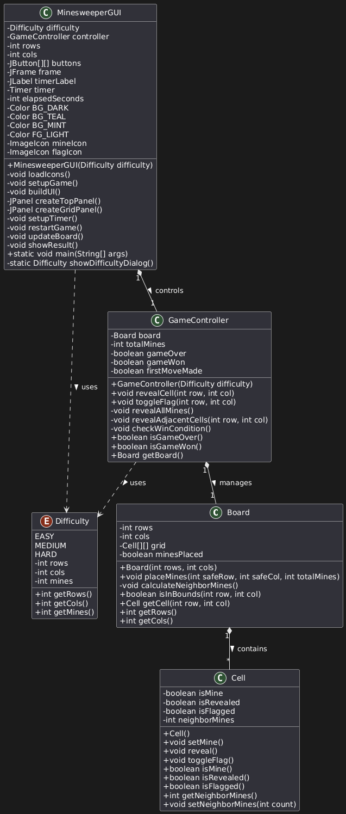

# java-minesweeper

This is my first attempt at creating the classic Minesweeper game in Java using Object-Oriented Programming (OOP) principles.

I applied OOP concepts such as **encapsulation**, **inheritance**, and more.

Below, I explain the main classes and what they do.

---

## My Classes




### Cell.java

This class represents a single cell on the Minesweeper board.

- Each cell can be a **mine** or **empty**.
- Each cell can be **flagged** by the player.

It has private attributes necessary for the game logic:

```java
private int neighborMines;  // Number of adjacent mines
private boolean isRevealed; // Whether the cell is revealed
private boolean isFlagged;  // Whether the cell is flagged
private boolean isMine;     // Whether the cell contains a mine
````

**Constructor** initializes the cell, and I added these key methods:

**Setters:**

```java
public void setMine() { this.isMine = true; }
public void toggleFlag() { this.isFlagged = !this.isFlagged; }
public void setNeighborMines(int count) { this.neighborMines = count; }
public void reveal() { this.isRevealed = true; }
```

**Getters:**

```java
public boolean isMine() { return isMine; }
public boolean isFlagged() { return isFlagged; }
public boolean isRevealed() { return isRevealed; }
public int getNeighborMines() { return neighborMines; }
```

---

### Difficulty.java

An enum listing the difficulty levels that players can choose:

```java
EASY(8, 8, 10),      // 8x8 grid with 10 mines
MEDIUM(16, 16, 40),  // 16x16 grid with 40 mines
HARD(24, 24, 99);    // 24x24 grid with 99 mines
```

Each difficulty defines the board size and mine count.

**Getters:**

```java
public int getRows() { return rows; }
public int getCols() { return cols; }
public int getMines() { return mines; }
```

*Note:* Enums don’t usually have setters since their values are constant.

---

### Board.java

Represents the Minesweeper board itself. Responsible for:

* Creating a grid of empty cells
* Randomly placing mines
* Calculating adjacent mine counts for each cell
* Checking if coordinates are within bounds
* Ensuring the first clicked cell is always safe

**Getters:**

```java
public int getRows() { return rows; }
public int getCols() { return cols; }
```

---

### GameController.java

Manages the game state and logic, handling:

* Player moves
* Game rules
* Win and lose conditions

**Constructor:** Initializes the board with the chosen difficulty.

```java
public GameController(Difficulty difficulty) {
    this.board = new Board(difficulty.getRows(), difficulty.getCols());
    this.gameOver = false;
    this.gameWon = false;
    this.totalMines = difficulty.getMines();
}
```

**Attributes:**

```java
private final Board board;
private boolean gameOver;
private boolean gameWon;
private boolean firstMoveMade = false;
private final int totalMines;
```

**Key methods:**

* `revealCell(int row, int col)`
* `toggleFlag(int row, int col)`
* `revealAdjacentCells(int row, int col)`
* `checkWinCondition()`
* `revealAllMines()`

**Getters:**

```java
public Board getBoard() { return board; }
public boolean isGameWon() { return gameWon; }
public boolean isGameOver() { return gameOver; }
```

---

### MinesweeperGUI.java

The main user interface that brings everything together.

Features include:

* Making sure the first clicked cell is always safe
* Asking the player to choose difficulty
* Displaying game results
* Restarting the game
* Loading custom icons
* Applying a color scheme
* Remembering the last difficulty when restarting

---

## Final note

I am still a beginner but getting the hang of Java and OOP slowly.
If you want to suggest changes or simplifications, please feel free to fork and let me know!

```